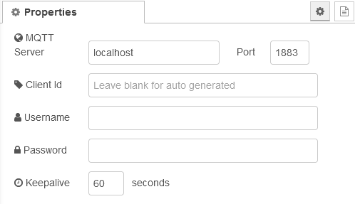

# Configuration Nodes

-   [NSPanel MQTT Config](#nspanel-mqtt-config-nspanel-config)
-   [NSPanel Config](#nspanel-config)

## NSPanel MQTT Config (nspanel-config)

Configuration used for all NSPanels to connect to a MQTT broker.

### Properties

-   **MQTT Server**: the address of the mqtt broker, can be prefixed with `mqtt://`, or `mqtts://` to use tls 
-   **Port**: The port the mqtt broker is listening on 
-   **Client Id**: Custom client id to use, otherwise auto generated 
-   **Username**: the username required by your broker, if any 
-   **Password**: the password required by your broker, if any 
-   **Keepalive**: 60 seconds or 0 to disable 

## NSPanel Config

Configuration for a specific NSPanel device.

### General

-   **Name**: Name used to identify the panel 
-   **NSPanel MQTT Config**: MQTT configuration for the panel 
-   **Device Topic**: device topic as configured in `Configure MQTT` section of the panel 
-   **Full Topic**: full topic as configured in `Configure MQTT` section of the panel using the `%prefix%` and `%topic%` placeholder 
-   **Standby timeout**: Default timeout in seconds for activating the screensaver 

#### Display Brightness

Brightness settings for day and night

-   **Stand by**: Brightness for stand-by mode 
-   **Active**: Brightness when using the panel 
-   **Starting time**: Time of day, when to activate the brightness settings 

#### Misc options

-   **Telemetry Period**: Interval in seconds for sensor update 
-   **Decouple buttons from relays**: Detaches the hardware buttons from relay control, so they can be used for event mappings 

### Updates

-   **Enable check for updates**: Enables checking for updates at the time configured 
-   **Install new firmware automatically**: Install new updates automatically, otherwise a notification is displayed on panel 
-   **Time to check for updates**: Time of day to perform update check 
-   **Tasmota OTA Url**: Url to the Tasmota firmware to use 

### Date & Time

-   **Language for date display**: The language for time and date localization 
-   **Clock notation**: Either 12-hour or 24-hour clock notation 
-   **Date and time format**: Configuration options for formatting the date and time 
-   **Use custom date and time format**: Enables advanced options for customizing the formatting of date and time 
