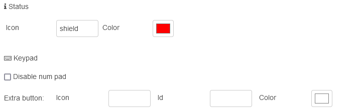

# Alarm Page Node

Alarm control panel

## Configuration

For information on general node configuration, please see section [Configuration](./page-nodes.md#configuration) for page nodes.

### Alarm page specific settings



-   **Icon**: The icon will be displayed right to the input field.<br/>
-   **Color**: The color used for the icon.<br/>
-   **Disable num pad**: When set, the numeric input pad is hidden<br/>
-   **Icon**: The numeric keypad has an additional button for which the icon is used<br/>
-   **Id**: When the extra button is pressed, the specified id is sent in the event message<br/>
-   **Color**: The color used for the icon of the extra button.<br/>

## Entities

Up to 4 buttons, which are displayed at the right of the screen.

## Input Messages

General information on configuration and input messages can be found in the documentation on the [page nodes](./page-nodes.md).

### Data Message

```json
{
    "topic": "data",
    "payload": {
        "statusIcon": "string",
        "statusIconColor": "string",
        "statusIconFlashing": "boolean",
        "numPadDisabled": "boolean"
    }
}
```

| Key | Description |
| --- | --- |
| `statusIcon` | optional, icon to show |
| `statusIconColor` | optional, the color to be used for the icon, hex rgb (`#rrggbb`) or integer format (`rgb(R,G,B)`) |
| `statusIconFlashing` | `true` for flashing status icon, otherwise `false` |
| `numPadDisabled` | `true` to hide num-pad, otherwise `false` |
