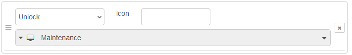

# Lockscreen Page Node

The lock screen node can be used to control access to other pages via PIN code.

General information on configuration and input messages can be found in the documentation on the [page nodes](./page-nodes.md).

## Configuration

For information on general node configuration, please see section [Configuration](./page-nodes.md#configuration) for page nodes.


-   **PIN**: PIN code to be entered on NSPanel to unlock the page<br/>
-   **Label confirm button**: Label for button, which submits entered PIN code to the backend<br/>
-   **Icon**:Icon displayed next to PIN code input field<br/>

### Events

The lockscreen page offers the _Unlock_ event, which can be assigned to actions such as page navigation on the _Events_ configuration tab. The unlock event is triggered when the configured PIN is entered on the display. 

## Input Messages

### Data Message

```json
{
    "topic": "data",
    "payload": {
        "statusIcon": "string",
        "statusIconColor": "string",
        "statusIconFlashing": "boolean",
        "numPadDisabled": "boolean"
    }
}
```

| Key | Description |
| --- | --- |
| `statusIcon` | optional, icon to show |
| `statusIconColor` | optional, the color to be used for the icon, hex rgb (`#rrggbb`) or integer format (`rgb(R,G,B)`) |
| `statusIconFlashing` | `true` for flashing status icon, otherwise `false` |
| `numPadDisabled` | `true` to hide num-pad, otherwise `false` |
