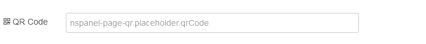

# QR Page Node

The QR page nodes shows a QR code and, if configured, additional text.

General information on configuration and input messages can be found in the documentation on the [page nodes](./page-nodes.md).

## Configuration

For information on general node configuration, please see section [Configuration](./page-nodes.md#configuration) for page nodes.

### QR page specific settings

-   **QR Code**: The text representation for the QR code 

#### WiFi QR Code

The semantics for wifi data is   `WIFI:S:<SSID>;T:<WEP|WPA|blank>;P:<PASSWORD>;H:<true|false|blank>;;`

-   **S**: `SSID` of the network
-   **T**: Authentication type (WPA means WPA/WPA2/WPA3)
-   **P**: password
-   **H**: optional, true if hidden

## Input Messages

### Data Message

Entity related data can be sent using the _data_ topic. For further details see section [Data Messages](./page-nodes.md#data-messages) for page nodes.
