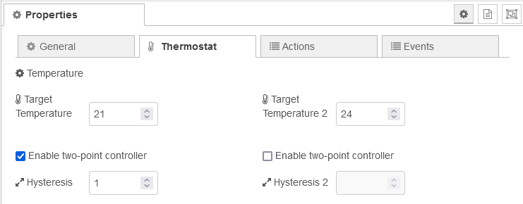
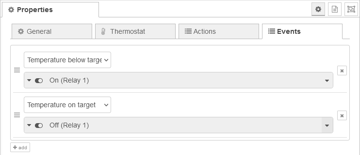

# Thermo Page Nodes

The Thermo page node represents a thermostat control panel.

## Configuration

For information on general node configuration, please see section [Configuration](./page-nodes.md#configuration) for page nodes.

### Thermo Page specific general configuration

Unlike to other pages, the Thermo page configures up to 8 actions instead of entities. .

The specified ID is used for the outgoing message in the `data` property of the payload when the action button is pressed. The action can also be linked to the status of a relay of the panel.


#### Options

-   **Current Temperature Label**: Label used for current temperature reading<br/>
-   **Status Label**: Label for current status<br/>
-   **Show details popup**: Enables the button to show further details in a pop-up<br/>
-   **Use panel temperature sensor**: Uses the NSPanel's internal sensor to display the current temperature<br/>
-   **Enable second target temperature**: Shows a second setpoint temperature control<br/>

#### Set Points

-   **Minimum Heating Setpoint**: Minimum temperature that can be entered<br/>
-   **Maximum Heating Setpoint**: Maximum temperature that can be entered<br/>
-   **Temperature Steps**: Interval used for upward and downward control of target temperature<br/>
-   **Temperature Unit**: Either Fahrenheit or Celsius<br/>

### Thermostat settings



-   **Target Temperature**: Target temperature<br/>
-   **Enable two-point controller**: Enables the two-point controller<br/>
-   **Hysteresis**: The deadband to be used for two-point control<br/>
-   **Target Temperature 2**: Second target temperature<br/>
-   **Enable two-point controller 2**: Enables the two-point controller 2<br/>
-   **Hysteresis 2**: The deadband to be used for the second two-point control<br/>

### Events



The thermo page node offers a basic two-point controller for the target temperature, which will emit the thermostat specific events, which can be assigned to actions:

-   _Temperature below target_,
-   _Temperature on target_,
-   _Temperature above target_

and, if the second target temperature is enabled

-   _Temperature below target 2_,
-   _Temperature on target 2_,
-   _Temperature above target 2_.

## Input Messages

### Data Message

Action related data can be sent using the _data_ topic in the same ways as entity data. For further details see section [Data Messages](./page-nodes.md#data-messages) for page nodes.

To transmit the state of the action, use the `value` property for each data object with `0` representing off and `1` on, respectively.

### Temperature Measurement Message

The current measured temperature values are received with the topic `thermo` and are used for the two-point control:

```json
{
    "topic": "thermo",
    "payload": {
        "temperature": "number",
        "temperature2": "number",
        "tempUnit": "string"
    }
}
```

| Key            | Description                                                                         |
| -------------- | ----------------------------------------------------------------------------------- |
| `temperature`  | optional, temperature measured                                                      |
| `temperature2` | optional, second temperature measured                                               |
| `tempUnit`     | optional, either `F` for Fahrenheit or `C` for Celsius, defaults to unit configured |

If the unit is not specified, the default unit is assumed. If the specified unit differs from the configured unit, it is converted to the configured unit.
