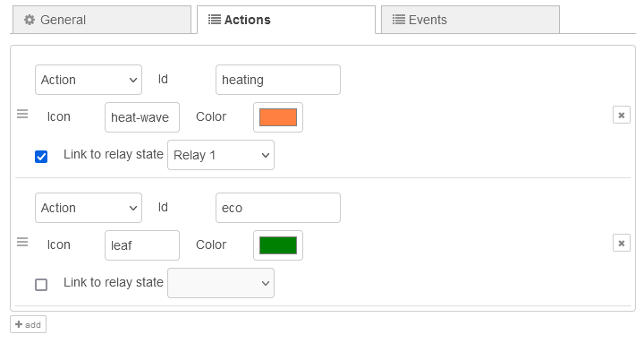
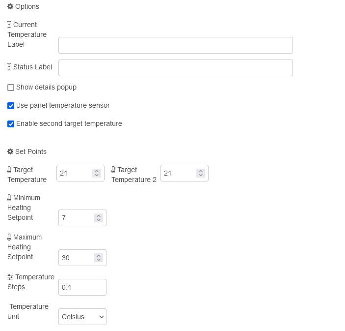

# Thermo Page Nodes

The Thermo page node represents a thermostat.

## Configuration

For information on general node configuration, please see section [Configuration](./page-nodes.md#configuration) for page nodes.

### Thermo Page specific configuration

Unlike to other pages, the Thermo page configures up to 8 actions instead of entities. .

The specified ID is used for the outgoing message in the `data` property of the payload when the action button is pressed. The action can also be linked to the status of a relay of the panel.

#### Options

-   **Current Temperature Label**: Label used for current temperature reading  
-   **Status Label**: Label for current status  
-   **Show details popup**: Enables the button to show further details in a pop-up  
-   **Use panel temperature sensor**: Uses the NSPanel's internal sensor to display the current temperature  
-   **Enable second target temperature**: Shows a second setpoint temperature control  

#### Set Points

-   **Target Temperature**: Target temperature  
-   **Target Temperature 2**: Second target temperature  
-   **Minimum Heating Setpoint**: Minimum temperature that can be entered  
-   **Maximum Heating Setpoint**: Maximum temperature that can be entered  
-   **Temperature Steps**: Interval used for upward and downward control of target temperature  
-   **Temperature Unit**: Either Fahrenheit or Celsius  

## Input Messages

### Data Message

Entity related data can be sent using the _data_ topic. For further details see section [Data Messages](./page-nodes.md#data-messages) for page nodes.
