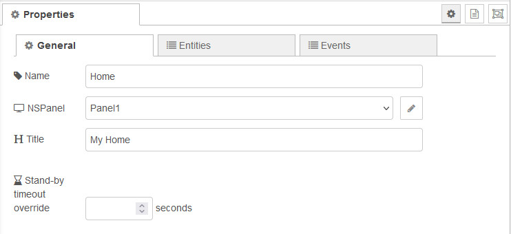
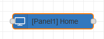
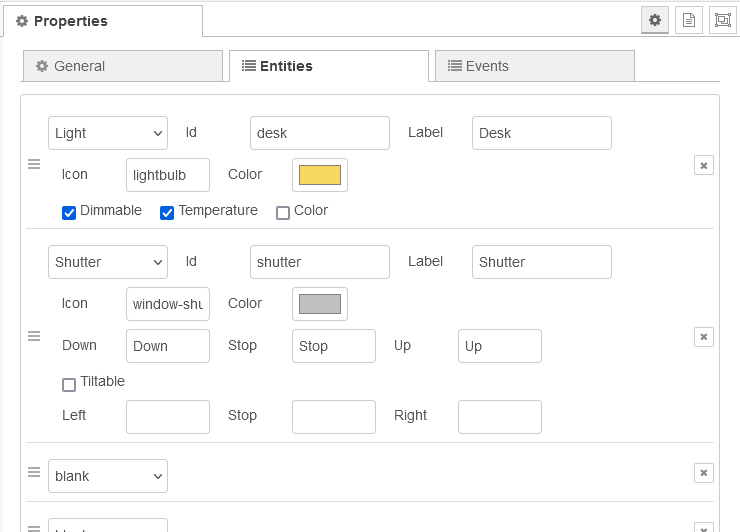
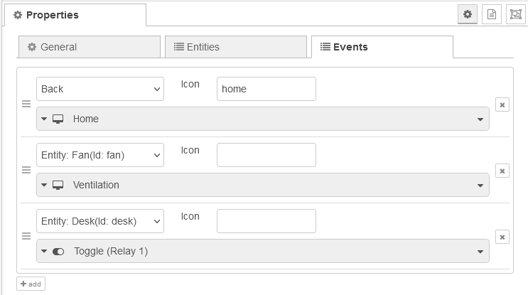

# Page Nodes

-   [General Information](#general-information)
    -   [Configuration](#configuration)
        -   [General Settings](#general-settings)
        -   [Entities](#entities)
        -   [Events](#events)
-   [Input Messages](#input-messages)
    -   [Data Messages](#data-messages)
        -   [Fan-specific payload data](#fan-specific-payload-data)
        -   [Light-specific payload data](#light-specific-payload-data)
        -   [Shutter-specific payload data](#shutter-specific-payload-data)
        -   [Switch-specific payload data](#switch-specific-payload-data)
    -   [Popup Data Messages](#popup-data-messages)
        -   [Input Selection (_selection_ entity)](#input-selection-selection-entity)
        -   [Timer (_timer_ entity)](#timer-timer-entity)
-   Page Nodes
    -   [Alarm Page](./page-node-alarm.md)
    -   [Chart Page](./page-node-chart.md)
    -   [Entities Page](./page-node-entities.md)
    -   [Grid / Grid Extended](./page-node-grid.md)
    -   [Lockscreen Page](./page-node-lockscreen.md)
    -   [Media Page](./page-node-media.md)
    -   [Power Page](./page-node-power.md)
    -   [QR Page](./page-node-qr.md)
    -   [Thermo Page](./page-node-thermo.md)

Further details on the main nodes like _Controller_, _ScreenSaver_, or _HMI Control_ please see the [main nodes docs](./nodes.md)

## General Information

### Configuration

#### General Settings



-   **Name**: Each node can be assigned a name that is displayed in the flow. Furthermore, this name may be used for explicit activation using messages sent to the HMI Control node.<br/>
-   **NSPanel**: The assignment to a panel activates the node so that it can be used on the specified panel. After the assignment, the name of the assigned panel is placed in front of the name of the node: <br/> <br/>
-   **Title**: The specified title will be used ons panel screen.<br/>
-   **Stand-by timeout override**: The standby timeout configured in the panel settings (NSPanel config node) can be overwritten on each page node. A timeout of `0` means that the page remains active.<br/>

#### Entities

Entities can be added to a page and configured accordingly. The number and types depend on the node type. The icons that can be used in node configuration is based on the Material Design Icons. All supported icons are listed in the [Lovelace UI Icon Cheatsheet](https://docs.nspanel.pky.eu/icon-cheatsheet.html).



#### Events

The Events tab can be used to set up the behavior of the page for certain events. There are various actions that can be assigned:

-   Sending messages
-   Activating other page nodes
-   Controling relay states.

The _Back_ and _Next_ events can be used to customize the navigation at the top of the page. The configured entities can also be used to trigger certain actions. If the "Decouple buttons from relays" option is set in the NSPanel configuration node, actions can be assigned to the hardware buttons.



## Input Messages

### Data Messages

Page item related data must be sent using the _data_ topic.

```json
{
    "topic": "data",
    "payload": {
        "entityId": "string",
        "icon": "string",
        "iconColor": "string",
        "text": "string"
        // <... further entity-specific data ...>
    }
}
```

| Key         | Description                                                    |
| ----------- | -------------------------------------------------------------- |
| `entityId`  | id of entity specified in configuration                        |
| `icon`      | optional, icon to display                                      |
| `iconColor` | optional, hex rgb (`#rrggbb`) or integer format (`rgb(R,G,B)`) |
| `text`      | optional, text to be shown                                     |

Additional data must be specified depending on the entity type.

#### Fan-specific payload data

```json
{
    "topic": "data",
    "payload": {
        // <... general entity data ...>
        "active": "<active state>",
        "speed": "number",
        "mode": "string"
    }
}
```

| Key      | Description                                                                          |
| -------- | ------------------------------------------------------------------------------------ |
| `active` | [ `false` \| `0` \| `'0'`] for off, and [`true` \| `1` \| `'1'`] for on respectively |
| `speed`  | speed level in range as configured for entity                                        |
| `mode`   | name of active mode as configured for entity                                         |

#### Light-specific payload data

```json
{
    "topic": "data",
    "payload": {
        // <... general entity data ...>
        "active": "<light on/off state>",
        "brightness": "number",
        "colorTemperature": "number",
        "hue": "number",
        "saturation": "number"
    }
}
```

| Key                | Description                                                                          |
| ------------------ | ------------------------------------------------------------------------------------ |
| `active`           | [ `false` \| `0` \| `'0'`] for off, and [`true` \| `1` \| `'1'`] for on respectively |
| `brightness`       | level of brightness [ `0` to `100`]                                                  |
| `colorTemperature` | color temperatur within range from `0` (cold) to `100` warm                          |
| `hue`              | color tone (hue) according to the HSV color model                                    |
| `saturation`       | saturation according to the HSV color model                                          |

#### Shutter-specific payload data

```json
{
    "topic": "data",
    "payload": {
        // <... general entity data ...>
        "value": "number",
        "tilt": "number"
    }
}
```

| Key     | Description                       |
| ------- | --------------------------------- |
| `value` | shutter position [ `0` to `100` ] |
| `tilt`  | tilt position [ `0` to `100` ]    |

#### Switch-specific payload data

```json
{
    "topic": "data",
    "payload": {
        // <... general entity data ...>
        "value": "<switch state>"
    }
}
```

| Key     | Description                                                                          |
| ------- | ------------------------------------------------------------------------------------ |
| `value` | [ `false` \| `0` \| `'0'`] for off, and [`true` \| `1` \| `'1'`] for on respectively |

### Popup Data Messages

#### Input Selection (_selection_ entity)

```json
{
    "topic": "data",
    "payload": {
        "entityId": "string",
        "iconColor": "string",
        "selectedOption": "string",
        "options": ["<array of strings>"]
    }
}
```

| Key              | Description                                                                                       |
| ---------------- | ------------------------------------------------------------------------------------------------- |
| `entityId`       | id of the entity as configured in node settings                                                   |
| `iconColor`      | optional, the color to be used for the icon, hex rgb (`#rrggbb`) or integer format (`rgb(R,G,B)`) |
| `selectedOption` | selected option, must be included in `options`                                                    |
| `options`        | available options to choose from                                                                  |

#### Timer (_timer_ entity)

```json
{
    "topic": "data",
    "payload": {
        "entityId": "string",
        "timerRemainingSeconds": "number",
        "action1": "string",
        "action2": "string",
        "action3": "string",
        "label1": "string",
        "label2": "string",
        "label3": "string"
    }
}
```

| Key                     | Description                                     |
| ----------------------- | ----------------------------------------------- |
| `entityId`              | id of the entity as configured in node settings |
| `timerRemainingSeconds` | remaining time in seconds                       |
| `action1`               | string to send for action 1                     |
| `action2`               | string to send for action 2                     |
| `action3`               | string to send for action 3                     |
| `label1`                | label to show for action 1 button               |
| `label3`                | label to show for action 2 button               |
| `label3`                | label to show for action 3 button               |
